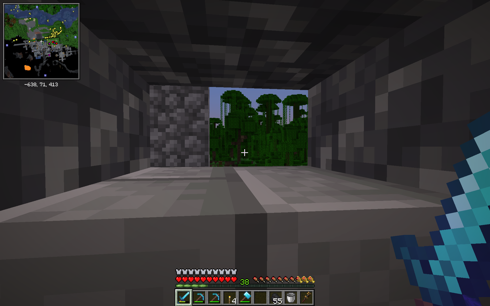
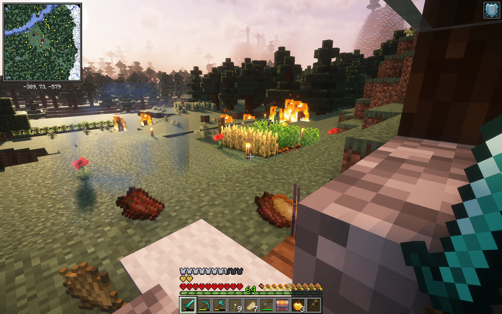
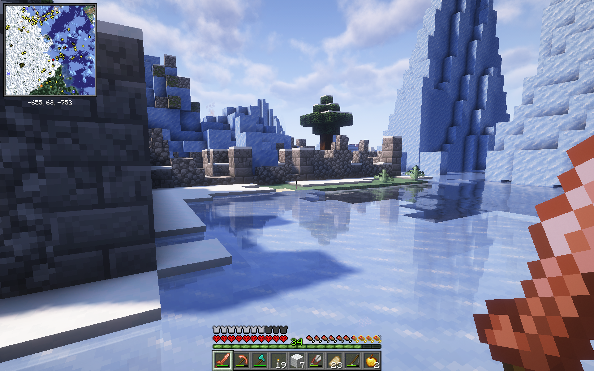
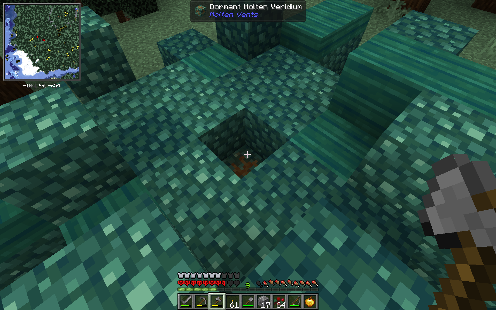
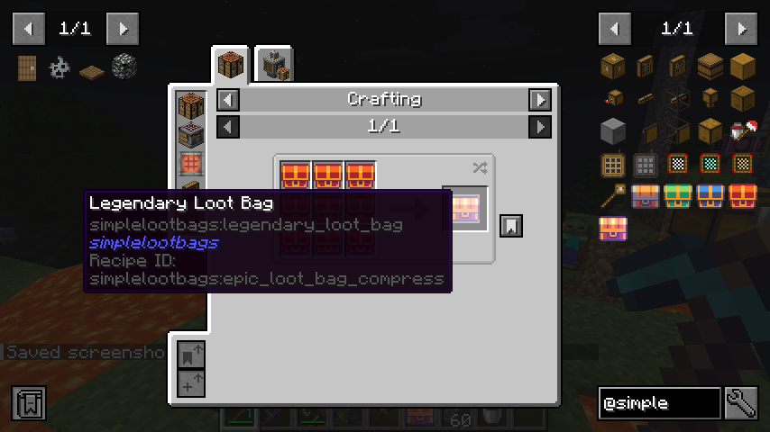
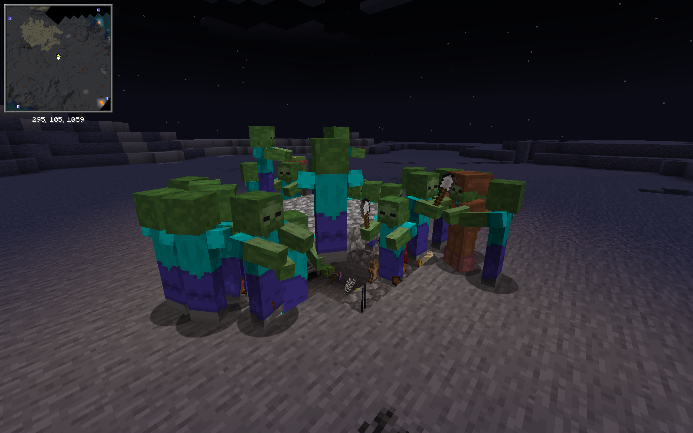
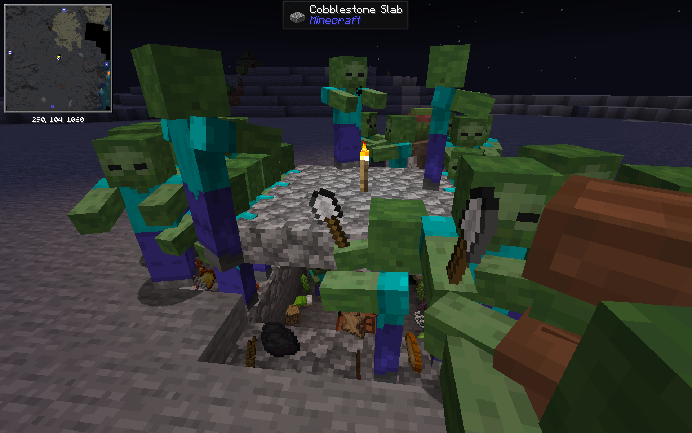

# Create vs Zombies

> Balance between base-building and exploration: use create to automate your production and salvage equipment.
> Hunt out molten vents for reusable ores. Find curios.
>
> But the world is dangerous every few nights, an undead horde will attack.
> The sun won’t stop them, be ready.
>
> Oh and every hit from an undead has a chance to infect you.
> Without a golden apple to cure you, the infection means certain death.

## Features

Balance your minecraft survival gameplay between base-building, logistical automation, and exploration.

- Use create to automate your production and salvage equipment
- Hunt out molten vents for reusable ores
- Find curios
- Create a safe outpost

## The overworld is a dangerous place

But this world is dangerous place.
Every few (1-7) nights an undead horde will attack and try to destroy what you've built.
Invading forces will grow stronger over time.
The sun won’t stop them so you should be ready for a long fight.

## The infection

Every hit from an undead has a chance to curse you with a zombie infection.
Armor can provide some protection but even a single hit can be fatal.
Without a cure in time, you'll die and your corpse will reanimate as a zombie.
Without a golden apple, an infection means certain death.

This infection has hit the other denizens of the world hard.
Peaceful villagers are on the edge of extinction and have rallied their defenses.
Zombie Villagers can't be cured using conventional mechanics.
Even pillagers aren't immune must fight off the hordes.

## Exploration is challenging

The world is not an empty place.
Not only do you have to worry about the undead or if the horde is coming this evening, the overworld itself is full of danger.
The Illagers have established numerous outposts, bases, and villages.
They too have to fight off the infection.
While dangerous, there is also resources to be had in those bases.

### Varied worldgen

There are also dungeons to explore.
Loot chests and other resources make this exploration a constant temptation from riding out the day in your base.

### Molten vents

If these resources aren't enough to get you exploring, search the overworld for molten vents.
They can be found in an outcropping of asurine, vitrine, ochra, etc.
Once you activate the block using an explosion, a lava source block touching the vent will generate more of that resource.
Grind those resources into ores.
Or simply dig to the bedrock for tuff.

## Combat rewards: loot bags

To help you out further, hostile mobs can drop a loot box that may drop resources to you with your progression.

These boxes come in five tiers with better and better loot.
Who knows, you might actually start looking forward to the next invasion.

## Invasions

How many invasions can you survive before becoming overwhelmed?

## Attribution

No modpack runs in isolation.
I've added links to the cool mods that I've included in this pack:

### Create: Pillager Arise

The Pillagers know how to Create as well.
Should you take the risk of raiding a Pillagers settlement for advanced Create equipment?

**Package:** `create_pillagers_arise-118.28.GL-neoforge-1.21.1.jar`

**Curseforge:** [Create: Pillager Arise](https://www.curseforge.com/minecraft/mc-mods/create-pillager-arise)

### Create Recycle Everything

Recycling is a core component of this modpack's gameplay.
Spplement your resource gathering from the remnants of your _epic_ invasion battles.

**Package:** `create_recycle_everything-1.0.1.jar`

**Curseforge:** [Create Recycle Everything](https://www.curseforge.com/minecraft/mc-mods/create-recycle-everything)

### Create: Protection Pixel

Perhaps a few Create recipies can even out the odds for you?

**Package:** `protection_pixel-1.9.4-neoforge-1.21.1.jar`

**Curseforge:** [Create: Protection Pixel](https://www.curseforge.com/minecraft/mc-mods/protection-pixel)

